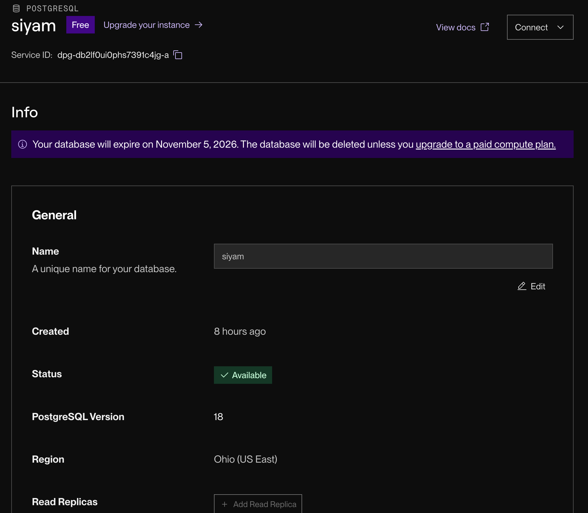
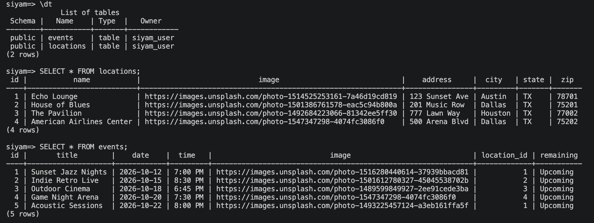

# WEB103 Project 3 - *UnityGrid Plaza*

Submitted by: **Siyam Seid**

About this web app: **UnityGrid Plaza is a virtual community space for discovering events at four venues: Echo Lounge, House of Blues, The Pavilion, and American Airlines Center. Users choose a venue by clicking it on an illustrated city skyline, see that venue's details and upcoming events, or browse every event on one page and filter by location. Each event shows a live countdown, and events that have already happened are clearly marked as ended. The React frontend pulls all venue and event data from an Express API backed by a PostgreSQL database hosted on Render.**

Time spent: **X** hours

## Required Features

The following **required** functionality is completed:

<!-- Make sure to check off completed functionality below -->

- [x] **The web app uses React to display data from the API**
- [x] **The web app is connected to a PostgreSQL database, with an appropriately structured Events table**
  - [x]  **NOTE: Your walkthrough added to the README must include a view of your Render dashboard demonstrating that your Postgres database is available**
  - [x]  **NOTE: Your walkthrough added to the README must include a demonstration of your table contents. Use the psql command 'SELECT * FROM tablename;' to display your table contents.**
- [x] **The web app displays a title.**
- [x] **Website includes a visual interface that allows users to select a location they would like to view.**
  - [x] *Note: A non-visual list of links to different locations is insufficient.*
- [x] **Each location has a detail page with its own unique URL.**
- [x] **Clicking on a location navigates to its corresponding detail page and displays list of all events from the `events` table associated with that location.**

The following **optional** features are implemented:

- [x] An additional page shows all possible events
  - [x] Users can sort *or* filter events by location.
- [x] Events display a countdown showing the time remaining before that event
  - [x] Events appear with different formatting when the event has passed (ex. negative time, indication the event has passed, crossed out, etc.).

The following **additional** features are implemented:

- [x] The countdown updates live every minute without a page refresh
- [x] Past events get a red "Event Ended" badge that is always visible, a grayscale image, and a crossed-out title
- [x] A "Show All Events" button on the Events page clears the location filter
- [x] Loading and empty states ("No events scheduled at this location yet!") instead of a blank page
- [x] Placeholder images are shown if an event or venue is missing an image
- [x] A `reset.js` script creates the `locations` and `events` tables (linked by a `location_id` foreign key) and seeds sample data

## Video Walkthrough

Here's a walkthrough of implemented required features:

<!-- Replace this with whatever GIF tool you used! -->
GIF created with **[GIF tool]**
<!-- Recommended tools:
[Kap](https://getkap.co/) for macOS
[ScreenToGif](https://www.screentogif.com/) for Windows
[peek](https://github.com/phw/peek) for Linux. -->

### Render Dashboard: Postgres Database Available

### Table Contents (`SELECT * FROM tablename;`)

## Notes

- **Matching events to locations:** Each event stores a `location_id` foreign key that points to the `locations` table, and the location pages and Events page filter events on that key. Getting the IDs to line up with the four venue routes (`/echolounge`, `/houseofblues`, `/pavilion`, `/americanairlines`) took some care.
- **Countdown timing:** Dates and times are stored as text (`2026-10-12` and `7:00 PM`), so the frontend had to combine and parse them, including the AM/PM conversion, before it could work out how much time is left.
- **Connecting to Render with psql:** Commands have to be typed one at a time and SQL statements need a closing semicolon. Pasting several lines at once caused psql to treat the later lines as arguments to the first command.

## License

Copyright 2026 Siyam Seid

Licensed under the Apache License, Version 2.0 (the "License"); you may not use this file except in compliance with the License. You may obtain a copy of the License at

> http://www.apache.org/licenses/LICENSE-2.0

Unless required by applicable law or agreed to in writing, software distributed under the License is distributed on an "AS IS" BASIS, WITHOUT WARRANTIES OR CONDITIONS OF ANY KIND, either express or implied. See the License for the specific language governing permissions and limitations under the License.
